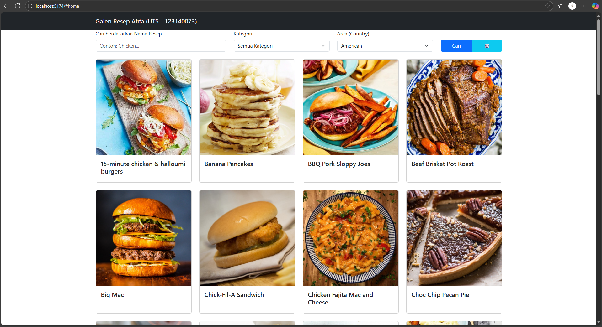

# UTS Pengembangan Aplikasi Web - Recipe Finder

Ini adalah proyek Ujian Tengah Semester (UTS) untuk mata kuliah IF25-22014 - Pengembangan Aplikasi Web.

* **Nama:** `Afifa Aulia`
* **NIM:** `123140073`
* **Studi Kasus:** Digit 3 - Recipe Finder

---

## 🚀 Link Deployment Vercel

Aplikasi ini telah di-deploy dan dapat diakses secara publik melalui link berikut:

**[https://link-deployment-vercel-anda.vercel.app/](https://link-deployment-vercel-anda.vercel.app/)**

---

## 📝 Deskripsi Aplikasi

**Recipe Finder** adalah aplikasi web berbasis React yang memungkinkan pengguna untuk mencari dan menemukan resep masakan dari seluruh dunia. Aplikasi ini dibuat sebagai pemenuhan tugas UTS dan mengimplementasikan 5 fitur wajib sesuai soal (Studi Kasus Digit 3).

Aplikasi ini menggunakan API publik dari **TheMealDB** untuk mengambil semua data resep.

### Fitur Utama

Sesuai dengan kriteria penilaian, aplikasi ini memiliki fitur:

1.  **Form Pencarian:** Form pencarian berdasarkan nama resep dan dropdown filter berdasarkan Kategori.
2.  **Tampilan Hasil (Grid Card):** Hasil pencarian ditampilkan dalam layout *Grid Card* yang responsif, menampilkan gambar dan nama resep.
3.  **Detail Resep:** Saat resep diklik, muncul *Modal* (popup) yang menampilkan detail lengkap, termasuk *Ingredients* (bahan-bahan) dan *Instructions* (langkah-langkah memasak).
4.  **Filter Tambahan:** Terdapat dropdown filter tambahan untuk menyaring resep berdasarkan **Area (Country)**.
5.  **Tombol Resep Acak:** Sebuah tombol (🎲) untuk mengambil dan menampilkan satu resep acak secara langsung di modal detail.

### Teknologi yang Digunakan

- **Framework:** React (dibuat dengan Vite)
- **Styling:** React-Bootstrap & Bootstrap 5
- **HTTP Client:** Axios
- **API:** TheMealDB (https://www.themealdb.com/api.php)
- **Deployment:** Vercel

---

## ⚙️ Cara Instalasi dan Menjalankan Lokal

Berikut adalah langkah-langkah untuk menjalankan proyek ini di perangkat lokal Anda.

### Prasyarat

- [Node.js](https://nodejs.org/) (v18 atau lebih baru direkomendasikan)
- [Git](https://git-scm.com/)

### Langkah-langkah Instalasi

1.  **Clone repository ini:**
    ```bash
    git clone [URL_GITHUB_ANDA]
    # Contoh: git clone [https://github.com/15-073-AfifaAulia/uts_pemweb_123140073](https://github.com/15-073-AfifaAulia/uts_pemweb_123140073)
    ```

2.  **Masuk ke direktori proyek:**
    ```bash
    cd uts-pemweb-123140073
    # Contoh: cd uts-pemweb-122140073
    ```

3.  **Install semua dependencies (library) yang dibutuhkan:**
    ```bash
    npm install
    ```

4.  **Jalankan local development server:**
    ```bash
    npm run dev
    ```

5.  Buka browser Anda dan akses [http://localhost:5173/](http://localhost:5173/) (atau port lain yang ditampilkan di terminal Anda).

**Catatan API Key:** Studi kasus (Digit 3 - TheMealDB) ini menggunakan API publik yang **tidak memerlukan API Key**.

---

## 📸 Screenshot Aplikasi

Berikut adalah tampilan dari aplikasi yang sudah berjalan.
